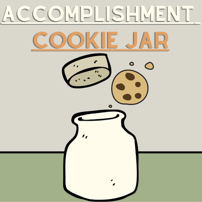
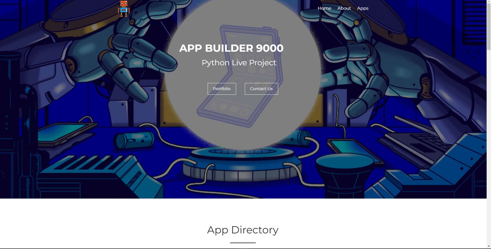
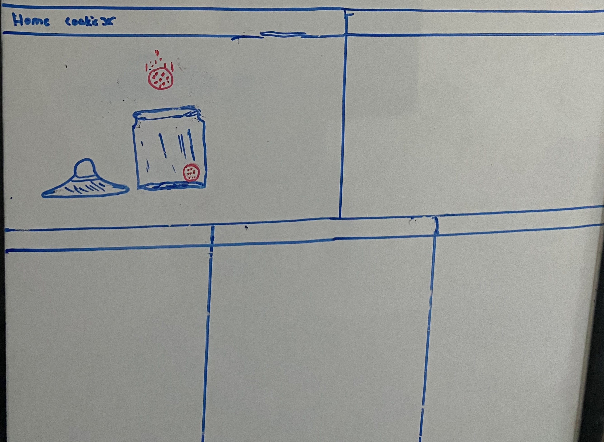
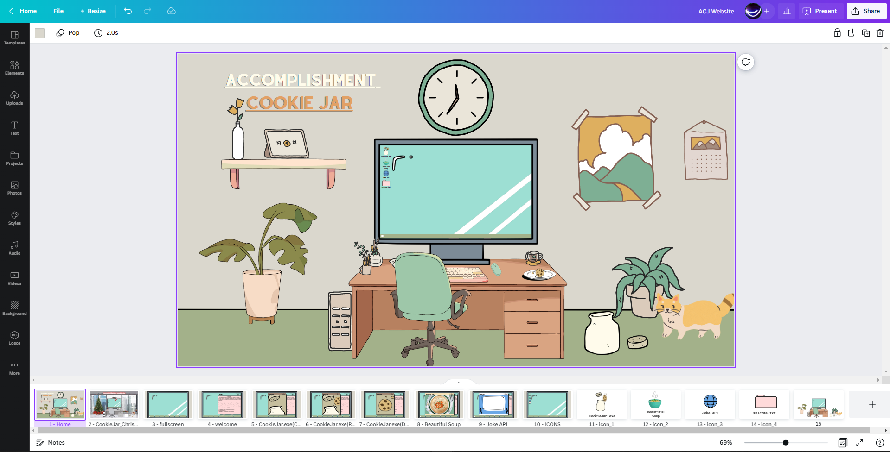
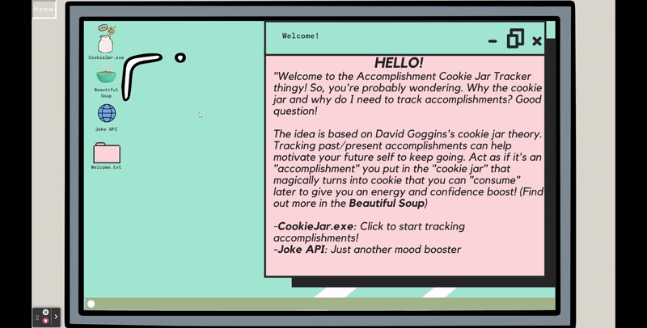

<a name="readme-top"></a>
<br>
<div align="center">
  <a href="https://github.com/CodeHappy01/Live-Projects-for-The-Tech-Academy/tree/main/Accomplishment-CookieJar/AccomplishmentTracker">
    
  </a>

<h3 align="center">Accomplishment Cookie Jar</h3>
</div>

<br>

<!-- TABLE OF CONTENTS -->
<details>
  <summary>Table of Contents</summary>
  <ol>
    <li>
      <a href="#about-the-project">About The Project:</a>
      <ul>
        <li><a href="#built-with">Built With</a></li>
      </ul>
    </li>
    <li>
      <a href="#cookiejarexecrud">CookieJar.exe(CRUD):</a>
      <ul>
        <li><a href="#create">Create</a></li>
        <li><a href="#read">Read</a></li>
        <li><a href="#update-and-delete">Update and Delete</a></li>
      </ul>
    </li>
    <li><a href="#beautiful-soup">Beautiful Soup:</a></li>
    <li><a href="#joke-api">Joke API:</a></li>
    <li><a href="#front-end-development">Front-End Development:</a></li>
    <li><a href="#skills-aquired">Skills Aquired:</a></li>
    <li><a href="#contact">Contact:</a></li>
    <li><a href="#acknowledgments">Acknowledgments:</a></li>
  </ol>
</details>

<br>

# About The Project:
During a two week sprint at [The Tech Academy](https://www.learncodinganywhere.com/) I had the opportunity to work with a team of very talented Software Engineers on a web Application called the "Appbuilder9000"! The Appbuilder9000 is an interactive website for managing one's collections of things related to various hobbies, as well as API and Data Scraped content for those hobbies.

The goal of the project was to create an app within the Application9000 with a topic of our own choice working with Python and Django utilizing their various features such as the Model, View, Template [(MVT)](https://www.geeksforgeeks.org/django-project-mvt-structure/). To build the app we were to create databases to keep track of data with a Create, Read, Update, Delete [(CRUD)](https://www.geeksforgeeks.org/django-crud-create-retrieve-update-delete-function-based-views/) functionality, have the app interact with APIs to retrieve data, use data scraping to collect and aggrigate data, and more! For the duriation of the sprint we worked under Azure Devops environment following the Agile/Scrum methodogies and being assigned to finish a total of 10 stories (2-9 being the main focus) before the end of the two week sprint.



With the ability to pick our own topic and work on out own seperate applications for the main site, this gave my team and I a chance to showcase are indivdual skills from the back-end to the front-end. 

The Application that I decided to create was [The Accomplishment Cookie Jar](https://github.com/CodeHappy01/Live-Projects-for-The-Tech-Academy/tree/main/Accomplishment-CookieJar/AccomplishmentTracker). The main pupose of my application is to allow people to keep track of their accomplishments to give them a way to boost there confidence whenever in need in the future. The idea of tracking accomplishments came from David Goggins [Cookie Jar theory](https://productiveclub.com/cookie-jar-method/#:~:text=The%20cookie%20jar%20method%20is%20a%20technique%20of,yourself%20of%20what%20you%20have%20achieved%20in%20life.)

Although, my site revolves around the Cookie Jar idea, it sorta accidently evolved into something much more. From a simple idea of having just the Cookie Jar that maybe let you drop an "accomplishment cookie" in it from a simple click...

(Drawing I made during brainstorming phase for my application topic)


I created a site that allows you to use a computer screen with in your own computer screen by clicking the "Full Screen" button from the main page which then lets you interact with three other apps. [The Beautiful Soup](#beautiful-soup) (data scraped webpage), [Joke API](#joke-api), and the [Welcome.txt](). From the main screen I even added an extra [suprise](#christmas) that lets you access a alter demension if you will were you work in an office building that getting ready for Christmas time!


I made my idea come to life by using the site [Canva](https://www.canva.com/), a graphic design platform that is used to create visual content for social media, presentations, websites and more! It also gives you access to many assets images both free or paid which I used heavily to help build my templates and icons for my application.



-----NOTE: This repository does NOT contain the "Appbuilder9000" as I do not have permission to share my peers projects, but you do have access to the code to my individual [application](https://github.com/CodeHappy01/Live-Projects-for-The-Tech-Academy/tree/main/Accomplishment-CookieJar/AccomplishmentTracker) --


<br>

## Built With

HTML | CSS | SQLITE | JS | PYTHON | DJANGO | PYCHARM | CANVA
 

# CookieJar.exe(CRUD):


 
 
 
 <br>

## Create 

[Story 2: Create your model] 


Create a model for the collection item you will be tracking and add the ability to create a new item. 

Create your model and add a migration, make sure to plan out all the categories you want to track for your object. Include an objects manager for accessing the database. 

Create a model form that will include any inputs the user needs to make 

Add a template to your app folder for creating a new item. 

Add a views function that renders the create page and utilizes the model form to save the collection item to the database. 


You are finished with the story when you have a functioning create page. This means the user can add to the database through your template rather than through admin. Make sure to test and debug before submitting. 

```xml
# Creating model for CookieJar.exe, title, date, text


class CookieJar(models.Model):
    Title = models.CharField(max_length=50)
    Date = models.DateTimeField(auto_now_add=True)
    Accomplishment = models.TextField(default='')

    # Object manager
    cookies = models.Manager()

    # Displays Cookie Title
    def __str__(self):
        return self.Accomplishment
```

<p align="right">(<a href="#readme-top">back to top</a>)</p>

<br>

## Read 

[Story 3: Display all items from database] 

Display information from the database in a page. 

Create a new HTML page, link it from your home page 

Add in a function that gets all the items from the database and sends them to the template 

Display a list of items from the database, with some of the fields for that item displayed with labels/headers. 

Add whatever styling is appropriate to your templates. 

You are finished with the story when you have a functioning page that lists the items in the database. Make sure to test and debug before submitting. 

 

[Story 4: Details page] 

 

Create a details page that will show the details of any single item from within the database, as selected by the user. Link this to the index page for each item. 

Add a details template to the template folder, register the url pattern 

Create a views function that will find a single item from the database and send it to the template 

Add in a link for each item on the display all items page that will direct to the details page for that item 

Display all the details of the item on the details page. 

Add whatever styling is appropriate to your templates. 

 <p align="right">(<a href="#readme-top">back to top</a>)</p>

<br> 

## Update and Delete 

[Story 5: Edit and Delete Functions] 

Allow for edits and delete functions to be done from the details page or from separate pages. Have confirmation before deleting. 

Add an edit page to the templates (another pattern url) 

Use model forms and instances to display the content of a single item from the database 

Have the views function send the information for the single item and save any changes. 

Include the option to delete an item with a confirmation that the user wants to delete. 

Add whatever styling is appropriate to your templates. 

You are finished with the story when you have a functioning edit page for any item in the database, and the ability to delete that item. Make sure to test and debug before submitting. 

Optional Add-On: 
-Use a modal and javascript for the delete confirmation message 

 <p align="right">(<a href="#readme-top">back to top</a>)</p>

<br>

# Beautiful Soup: 


[Stories 6 & 7: Beautiful Soup] 

Story 6: Create a new template for displaying information sourced from another website. Use Beautiful Soup to data scrape the site and find the relevant information. 

Create a new template for displaying the content 

Use Beautiful Soup to get the html data from your selected site as a navigable object 

Utilizing whatever options necessary, get the section of data you want to scrape 

Add comments to note which portions of the data you're trying to extract 

Link the data scraping page to the app's home page 

Story 7: Parse through the html returned and display the information you want to display. Make sure you are getting into the individual elements and stripping away any formatting you don't want. Add a link from your app's home page. 

Get elements out of your Beautiful Soup object, send just the values you want as relevant dictionary objects to the template (nested dictionaries are fine) 

Display all objects within the data scrape template 

Test to make sure everything works as expected, do error handling where necessary 

Add whatever styling is appropriate to your templates. 

This is the last Beautiful Soup story. Make sure it has all the functionality that you want. 

 <p align="right">(<a href="#readme-top">back to top</a>)</p>

<br> 

# Joke API: 



[Stories 6 & 7: API] 

Story 6: Connect to your chosen API and get the JSON response, add in a template for displaying the information. 

Create a new API template and render with a function 

Go through the API documentation 

Connect to the API and write a basic JSON response (either to a txt file or the terminal) 

Add comments of which elements from the JSON response you're looking to get the value for 

Link the API request page to the app's home page. 

Story 7: Parse through the JSON file returned and display the information you want to display. Make additional queries to the API as necessary. Add a link from your app's home page. 

Get elements out of your API JSON response, send just the values you want as relevant dictionary objects to the template (nested dictionaries are fine) 

Display all objects either in the original API service page or in a new results page. 

Test to make sure all the options work as expected, do error handling where necessary 

Add whatever styling is appropriate to your templates. 

This is the last API story. Make sure it has all the functionality that you want. 

You are finished with the story when you have information displaying from the API on your API page, and you've added all functionality you want to interact with the API. Make sure to test and debug before submitting. 

 

 

[Story 9: Save API or scraped results] 

Allow the user to save "favorites" of an item either from the information detailed from the API or from Beautiful Soup. This could mean working with the existing model or creating a new one to pull the information from the response, create the appropriate object, and add it to the database. 

You are finished with the story when you have the ability to save an item to the database with a few clicks from either your API page or your Data Scraping page. It is fine to have additional pages for the confirmation and display process. 

 <p align="right">(<a href="#readme-top">back to top</a>)</p>

<br>

# Front End Development:

[Story 8: Front End Improvements] 

Go through your various templates and add improvements to the UI/UX. This may include hover effects, pop-ups, animations, changes to the existing styling, etc. Show off your creativity and styling ability with some JavaScript in this. Make sure to test and debug before submitting. 


<br>

### Window Browswer Scaling - 


 <p align="right">(<a href="#readme-top">back to top</a>)</p>

<br>


## Christmas


At the end of my stories I decided to have a bit of fun with the time I had left and made a Christmas template through Canva and back in Pycharm I decided to add a Christams video along with a count down till Christmas counter using Javascript: 

 <p align="right">(<a href="#readme-top">back to top</a>)</p>

<br>

### Counter


https://github.com/CodeHappy01/Live-Projects-for-The-Tech-Academy/blob/bccf8525bc902442ce7024f828d99df38b968608/Accomplishment-CookieJar/AccomplishmentTracker/static/js/AccomplishmentTracker.js#L13-L66

 <p align="right">(<a href="#readme-top">back to top</a>)</p>

<br>

# Skills Acquired: 

 

A skill that I found to be pretty good at is utilizing Canva’s to build my backgrounds and icons for my web application. Being able to express my creativity without spending too much time with my own drawings   definitely something that I will take with me and  

 

Another is being able to work with a team of others and communicating how my application works, and even helping others.  

 

Obvious skills that I note from the project was working with the model, view, templates layout of django,.  

 <p align="right">(<a href="#readme-top">back to top</a>)</p>

<br>

# Contact:

- I had an amazing experience with this project and The Tech Academy and happy with what I was able to accomplish within the 2 week time frame. Although there is alot of things I could have done better I learned alot and will be sure to take these lessons into my future projects.
- 
-   I actually do plan on going back and using this as a framework for a bigger personal project that I wish to work on. If you would like details or are interested in possible collaberating on this project or even if you just want to get in contact to ask me questions, reach out to me at my email or LinkedIn.

- Email: bradleyrobles88@gmail.com
- [LinkedIn](https://www.linkedin.com/in/bradley-robles/)

 <p align="right">(<a href="#readme-top">back to top</a>)</p>

<br>


 
