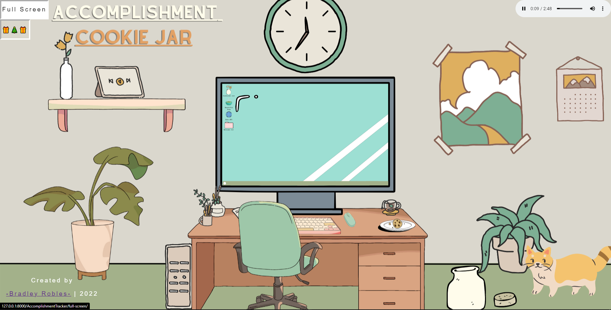
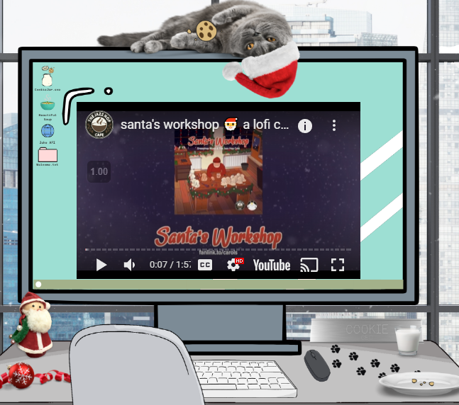

<br />
<div align="center">
  <a href="#">
    
  </a>

<h3 align="center">Accomplishment Cookie Jar</h3>
</div>

<br>

<!-- TABLE OF CONTENTS -->
<details>
  <summary>Table of Contents</summary>
  <ol>
    <li>
      <a href="#about-the-project">About The Project</a>
      <ul>
        <li><a href="#built-with">Built With</a></li>
      </ul>
    </li>
    <li>
      <a href="#crud-functionality-stories">CRUD Functionality Stories</a>
      <ul>
        <li><a href="#create">Create</a></li>
        <li><a href="#read">Read</a></li>
        <li><a href="#update-and-delete">Update and Delete</a></li>
      </ul>
    </li>
     <li>
      <a href="#web-scraping-and-api-stories">Web Scraping and API Stories</a>
      <ul>
        <li><a href="#web-scraping">Web Scraping</a></li>
        <li><a href="#api">API</a></li>
      </ul>
    </li>
    <li><a href="#front-end-development">Front-End Development</a></li>
    <li><a href="#skills-aquired">Skills Aquired</a></li>
    <li><a href="#contact">Contact</a></li>
    <li><a href="#acknowledgments">Acknowledgments</a></li>
  </ol>
</details>

<br>

## About The Project
During a two week springt at [The Tech Academy](https://www.learncodinganywhere.com/) I had the opportunity to work with a team of very talented peers on a web Application called the "Appbuilder9000"! We worked under Azure Devops environment being assigned 10 stories (2-9 being the main focus) to complete by the end of the sprint. 


Although, we worked on the same site we had the chance to work on are own individual applications that connected to the main page. This allowed my team and I to showcase are own skills while following the stories assigned to us along the way. 


I made my idea come to life by using the site [Canva](https://www.canva.com/), a graphic design platform that is used to create visual content for social media, presentations, websites, etc. 



<br>

# Built With

HTML | CSS | JS | PYTHON | DJANGO
 

# CRUD Functionality Stories

 
 
 <br>

## Create 

[Story 2: Create your model] 

Story #2: Create your model 

Create a model for the collection item you will be tracking and add the ability to create a new item. 

Create your model and add a migration, make sure to plan out all the categories you want to track for your object. Include an objects manager for accessing the database. 

Create a model form that will include any inputs the user needs to make 

Add a template to your app folder for creating a new item. 

Add a views function that renders the create page and utilizes the model form to save the collection item to the database. 

Check the database to make sure your item saves without errors. 

Add whatever styling is appropriate to your templates. 

You are finished with the story when you have a functioning create page. This means the user can add to the database through your template rather than through admin. Make sure to test and debug before submitting. 

```xml
# Creating model for CookieJar.exe, title, date, text


class CookieJar(models.Model):
    Title = models.CharField(max_length=50)
    Date = models.DateTimeField(auto_now_add=True)
    Accomplishment = models.TextField(default='')

    # Object manager
    cookies = models.Manager()

    # Displays Cookie Title
    def __str__(self):
        return self.Accomplishment
```

<br>

## Read 

[Story 3: Display all items from database] 

Display information from the database in a page. 

Create a new HTML page, link it from your home page 

Add in a function that gets all the items from the database and sends them to the template 

Display a list of items from the database, with some of the fields for that item displayed with labels/headers. 

Add whatever styling is appropriate to your templates. 

You are finished with the story when you have a functioning page that lists the items in the database. Make sure to test and debug before submitting. 

 

[Story 4: Details page] 

 

Create a details page that will show the details of any single item from within the database, as selected by the user. Link this to the index page for each item. 

Add a details template to the template folder, register the url pattern 

Create a views function that will find a single item from the database and send it to the template 

Add in a link for each item on the display all items page that will direct to the details page for that item 

Display all the details of the item on the details page. 

Add whatever styling is appropriate to your templates. 

<br> 

## Update and Delete 

[Story 5: Edit and Delete Functions] 

Allow for edits and delete functions to be done from the details page or from separate pages. Have confirmation before deleting. 

Add an edit page to the templates (another pattern url) 

Use model forms and instances to display the content of a single item from the database 

Have the views function send the information for the single item and save any changes. 

Include the option to delete an item with a confirmation that the user wants to delete. 

Add whatever styling is appropriate to your templates. 

You are finished with the story when you have a functioning edit page for any item in the database, and the ability to delete that item. Make sure to test and debug before submitting. 

Optional Add-On: 
-Use a modal and javascript for the delete confirmation message 

<br>

# Web Scraping and API Stories 
 
 <br>

## Web Scraping 


[Stories 6 & 7: Beautiful Soup] 

Story 6: Create a new template for displaying information sourced from another website. Use Beautiful Soup to data scrape the site and find the relevant information. 

Create a new template for displaying the content 

Use Beautiful Soup to get the html data from your selected site as a navigable object 

Utilizing whatever options necessary, get the section of data you want to scrape 

Add comments to note which portions of the data you're trying to extract 

Link the data scraping page to the app's home page 

Story 7: Parse through the html returned and display the information you want to display. Make sure you are getting into the individual elements and stripping away any formatting you don't want. Add a link from your app's home page. 

Get elements out of your Beautiful Soup object, send just the values you want as relevant dictionary objects to the template (nested dictionaries are fine) 

Display all objects within the data scrape template 

Test to make sure everything works as expected, do error handling where necessary 

Add whatever styling is appropriate to your templates. 

This is the last Beautiful Soup story. Make sure it has all the functionality that you want. 

<br> 

## API 


[Stories 6 & 7: API] 

Story 6: Connect to your chosen API and get the JSON response, add in a template for displaying the information. 

Create a new API template and render with a function 

Go through the API documentation 

Connect to the API and write a basic JSON response (either to a txt file or the terminal) 

Add comments of which elements from the JSON response you're looking to get the value for 

Link the API request page to the app's home page. 

Story 7: Parse through the JSON file returned and display the information you want to display. Make additional queries to the API as necessary. Add a link from your app's home page. 

Get elements out of your API JSON response, send just the values you want as relevant dictionary objects to the template (nested dictionaries are fine) 

Display all objects either in the original API service page or in a new results page. 

Test to make sure all the options work as expected, do error handling where necessary 

Add whatever styling is appropriate to your templates. 

This is the last API story. Make sure it has all the functionality that you want. 

You are finished with the story when you have information displaying from the API on your API page, and you've added all functionality you want to interact with the API. Make sure to test and debug before submitting. 

 

 

[Story 9: Save API or scraped results] 

Allow the user to save "favorites" of an item either from the information detailed from the API or from Beautiful Soup. This could mean working with the existing model or creating a new one to pull the information from the response, create the appropriate object, and add it to the database. 

You are finished with the story when you have the ability to save an item to the database with a few clicks from either your API page or your Data Scraping page. It is fine to have additional pages for the confirmation and display process. 

<br>

# Front End Development


[Story 8: Front End Improvements] 

Go through your various templates and add improvements to the UI/UX. This may include hover effects, pop-ups, animations, changes to the existing styling, etc. Show off your creativity and styling ability. 

You are finished with the story when you've added all functionality you want to for your UI/UX. Ideally, there should be some JavaScript in this. Make sure to test and debug before submitting. 

[Any other Front End work you’ve done that you would like to showcase] 

Christmas - 




Window Browswer Scaling - 


 <br>

# Skills Acquired: 

 

A skill that I found to be pretty good at is utilizing Canva’s to build my backgrounds and icons for my web application. Being able to express my creativity without spending too much time with my own drawings   definitely something that I will take with me and  

 

Another is being able to work with a team of others and communicating how my application works, and even helping others.  

 

Obvious skills that I note from the project was working with the model, view, templates layout of django,.  

<br>

# Contact
 
