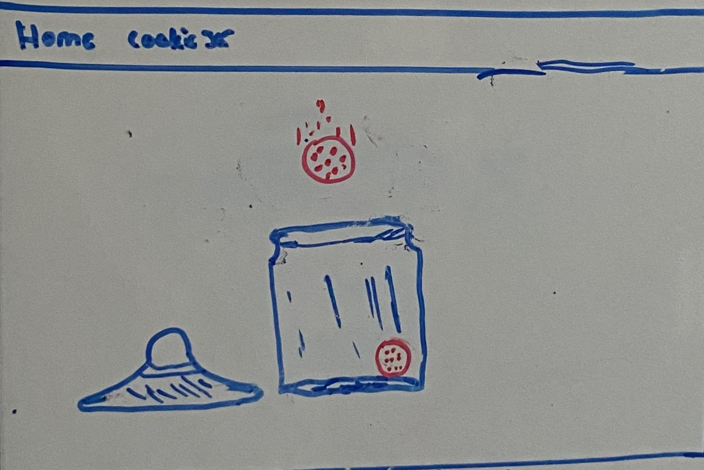

 

  

<h3 align="center">Accomplishment Cookie Jar</h3>

 

<!-- TABLE OF CONTENTS -->

  
Table of Contents

  <ol>
    <li>
      <a href="#about-the-project">About The Project:</a>
      <ul>
        <li><a href="#built-with">Built With</a></li>
      </ul>
    </li>
    <li><a href="#welcometxt">Welcome.txt:</a></li>
    <li>
      <a href="#cookiejarexecrud">CookieJar.exe(CRUD):</a>
      <ul>
        <li><a href="#create">Create</a></li>
        <li><a href="#read">Read</a></li>
        <li><a href="#update-and-delete">Update and Delete</a></li>
      </ul>
    </li>
    <li><a href="#beautiful-soup">Beautiful Soup:</a></li>
    <li><a href="#joke-api">Joke API:</a></li>
    <li><a href="#front-end-development">Front-End Development:</a></li>
    <ul>
        <li><a href="#django-template-utilization">Django Template Utilization</a></li>
        <li><a href="#christmas">Christmas</a></li>       
      </ul>
    <li><a href="#skills-aquired">Skills Aquired:</a></li>
    <li><a href="#contact">Contact:</a></li>
  </ol>

 

# About The Project:

- During my time at [The Tech Academy](https://www.learncodinganywhere.com/) I had the opportunity to work along side a team of highly talented Software Engineers on a web application called the App Builder 9000! The App Builder 9000 is an interactive website for managing one's [collections of things](Accomplishment-CookieJar/images/ScreenShots/AB9000Apps.png) related to various hobbies, as well as API and Data Scraped content for those hobbies.

- The goal of the project was to create an app with a topic of our own choice within The App Builder 9000 working with Python and Django utilizing their various features such as the Model, View, and Template [(MVT)](https://www.geeksforgeeks.org/django-project-mvt-structure/) layout. When building the app we needed to create databases to keep track of data, build a Create, Read, Update, Delete [(CRUD)](https://www.geeksforgeeks.org/django-crud-create-retrieve-update-delete-function-based-views/) functionality, have the app interact with APIs to retrieve data, use data scraping to collect and aggrigate data, and more! The work enviroment we worked under was [Azure Devops](https://azure.microsoft.com/en-us/products/devops/) following the [Agile/Scrum](https://www.visual-paradigm.com/scrum/what-is-agile-and-scrum/) methodogies and being assigned to finish a total of 10 stories (2-9 being the main focus) before the end of a sprint that lasted two weeks.

| NOTE: This repository does NOT contain the "Appbuilder9000" as I do not have permission to share my peers projects but, you do have access to the code for my individual application that I worked on [here](https://github.com/CodeHappy01/Live-Projects-for-The-Tech-Academy/tree/main/Accomplishment-CookieJar/AccomplishmentTracker) | 

 

(Drawing I made during brainstorming phase for my application topic)

- With the ability to pick our own topic and work on our own seperate applications for the main site, this gave my team and I a chance to really showcase are skills from the front-end to the back-end. The Application that I decided to create was [The Accomplishment Cookie Jar](https://github.com/CodeHappy01/Live-Projects-for-The-Tech-Academy/tree/main/Accomplishment-CookieJar/AccomplishmentTracker). The main pupose of my application is to allow people to keep track of their accomplishments in a form of a cookie that you can grab from a cookie jar. It sort of gives people a way to reassure there future self what they are capable of, to help boost their confidence whenever they may feel discourage about something. The idea of tracking accomplishments was inspired by David Goggins [Cookie Jar theory.](https://productiveclub.com/cookie-jar-method/#:~:text=The%20cookie%20jar%20method%20is%20a%20technique%20of,yourself%20of%20what%20you%20have%20achieved%20in%20life.)

- Although, from the very start, my site revolved around the Cookie Jar idea, it sorta just slowly evolved into something much more. From a simple idea of having just a Cookie Jar that let you drop an "Accomplishment Cookie" in...

 

- to becoming a full styled-out web application that puts you in a cozy bedroom with a computer screen that is fully interactable! By clicking the "Full Screen" [navbar button](#music-navbar) from the main page it lets you use the four provided apps on the computer screen. The [CookieJar.exe](#cookiejarexecrud) (CRUD), [The Beautiful Soup](#beautiful-soup) (data scraped webpage), [Joke API](#joke-api) (API), and the [Welcome.txt](#welcometxt) (briefly explains what each app does). From the home screen I also included both a [Christmas](#christmas) button that navigates you to an office building decorated with Christmas decorations and also included some relaxing [Lofi background music](#music-navbar).

 

- How I made my background, icons and most of my styling really come to life was by utilizing [Canva](https://www.canva.com/), a graphic design platform that is used to create visual content for social media, presentations, websites and more! The site gives you access to many copyright assets. I highly recommend it to anyone, beginner to advanced, that is into styling and designing!

 

## Built With

 

# Welcome.txt

 
 
 - Computer screen application that explains what the Cookie Jar method is and briefly explains what each other application does.

 
(<a href="#readme-top">back to top</a>)

# CookieJar.exe(CRUD):

 
 
 - The CookieJar.exe is an application you can access on the full screen that allows you to CREATE accomplishments, dropping them into the cookie jar that turns them into a cookie to READ, UPDATE and DELETE. It was created following stories 2 -5.
 
  

## Create 

  
Story 2: Create your model <a href="https://github.com/CodeHappy01/Live-Projects-for-The-Tech-Academy/blob/main/Accomplishment-CookieJar/AccomplishmentTracker/templates/AccomplishmentTracker/AccomplishmentTracker_create.html">[TPL]</a>

  <ol>
    <ul>
      
 
  I create a model for tracking Accomplishments with an objects manager for accessing the database, created a model form that will include any inputs the user needs to make, add a views function that renders the an html create page and utilizes the model form to save the collection item to the database.
      

      <li> Model-    
https://github.com/CodeHappy01/Live-Projects-for-The-Tech-Academy/blob/6a11c4e71f0661360b7deb38fe4b2f0ff7d3c127/Accomplishment-CookieJar/AccomplishmentTracker/models.py#L4-L17
      </li>
      <li> Model Form-
        https://github.com/CodeHappy01/Live-Projects-for-The-Tech-Academy/blob/7eacd8a182faff64c9c6a9f5e7e3dbd99cfa8349/Accomplishment-CookieJar/AccomplishmentTracker/forms.py#L6-L9
      </li>
      <li> View-
        https://github.com/CodeHappy01/Live-Projects-for-The-Tech-Academy/blob/6a11c4e71f0661360b7deb38fe4b2f0ff7d3c127/Accomplishment-CookieJar/AccomplishmentTracker/views.py#L33-L42
      </li>
    </ul>
  </ol>

(<a href="#readme-top">back to top</a>)

## Read 

  
Story 3: Display all items from database <a href="Accomplishment-CookieJar/AccomplishmentTracker/templates/AccomplishmentTracker/AccomplishmentTracker_read.html">[TPL]</a>

  <ol>
     
   * Displayed information from the database in a page by creating a new HTML page, linked it from your home page. Add in a function that gets all the items from the database and sends them to the template. Display a list of items from the database, with some of the fields for that item displayed with labels/headers. Add whatever styling is appropriate to your templates. 
    <ul>
    </ul>
  </ol>

  
Story 4: Details page <a href="Accomplishment-CookieJar/AccomplishmentTracker/templates/AccomplishmentTracker/AccomplishmentTracker_details.html">[TPL]</a>

  <ol>
    <ul> 
Created a details page that will show the details of any single item from within the database, as selected by the user, link this to the base page for each item. Add a details template to the template folder, register the url pattern. Create a views function that will find a single item from the database and send it to the template. Add in a link for each item on the display all items page that will direct to the details page for that item. Display all the details of the item on the details page. 
       
    </ul>
  </ol>

 
(<a href="#readme-top">back to top</a>)

## Update and Delete 

  
Story 5: Edit and Delete Functions <a href="Accomplishment-CookieJar/AccomplishmentTracker/templates/AccomplishmentTracker/AccomplishmentTracker_update.html">[Edit TPL]</a><a href="Accomplishment-CookieJar/AccomplishmentTracker/templates/AccomplishmentTracker/AccomplishmentTracker_delete.html">[Delete TPL]</a>

  <ol>
    <ul> 
I added an edit and delete function that dispays a confirmation before deleting message, an edit page, created a model form and instances to display the content of a single accomplishment from the database, have the views function send the information for the single item and save any changes. 
         
    </ul>
  </ol>

 
(<a href="#readme-top">back to top</a>)

# Beautiful Soup: 

- The Beautiful Soup is an application you can access on the full screen that displays scraped data from a web page that explains more about cookie jar theory.

  
Story 6: Setup Beautiful Soup <a href="Accomplishment-CookieJar/AccomplishmentTracker/templates/AccomplishmentTracker/AccomplishmentTracker_BS.html">[TPL]</a>

  <ol>
    <ul> 
  I create a new template for displaying information sourced from another website that explains what the Cookie Jar theory is, used <a href="https://www.tutorialspoint.com/beautiful_soup/beautiful_soup_quick_guide.htm">Beautiful Soup</a> to data scrape the site for qoutes about the Cookie Jar theory, create a new template for displaying the content and linked the data <a href="https://productiveclub.com/cookie-jar-method/#How_to_apply_the_cookie_jar_method">scraping page</a> to the app's home page 
       
    </ul>
  </ol>

  
Story 7: Parse through HTML <a href="Accomplishment-CookieJar/AccomplishmentTracker/templates/AccomplishmentTracker/AccomplishmentTracker_BS.html">[TPL]</a>

  <ol>
    <ul> 
Parse through the html, returned and displayed the information from scraping page, made sure to get into the individual elements and stripping away any formatting I didn't want, got elements out of the Beautiful Soup object, sent just the values I wanted as relevant dictionary objects to the template, display all objects within the data scrape template.
       
    </ul>
  </ol>

 
(<a href="#readme-top">back to top</a>)

# Joke API: 

- The Joke API is an application you can access on the full screen that allows you to read randomly generated jokes and save the jokes to read later.

  
Story 6: Connect to API <a href="Accomplishment-CookieJar/AccomplishmentTracker/templates/AccomplishmentTracker/at_joke_api.html">[TPL]</a>

  <ol>
    <ul> 
Connected my chosen <a href="https://jokeapi.dev/">Joke API<a>, read the API documentation, created a new API template rendered with a function, connected to the API and write a basic JSON response (either to a txt file or the terminal).
     
    </ul>
  </ol>

  
Story 7: Parse through JSON <a href="Accomplishment-CookieJar/AccomplishmentTracker/templates/AccomplishmentTracker/at_joke_api.html">[TPL]</a>

  <ol>
    <ul> 
Parse through the JSON file and returned jokes from Joke API by getting elements out of your API JSON response, sent my jokes to dictionary objects to the template.
     
    </ul>
  </ol>

 

  
Story 9: Save/Read API or scraped results <a href="Accomplishment-CookieJar/AccomplishmentTracker/templates/AccomplishmentTracker/at_save_joke_api.html">[SAVE API TPL]</a> <a href="Accomplishment-CookieJar/AccomplishmentTracker/templates/AccomplishmentTracker/at_save_joke_api.html">[READ API TPL]</a>

  <ol>
    <ul> 
      

We were given the choice whether to save "favorites" of an item either from the information detailed from the API or from Beautiful Soup. I decided to choice to save jokes from my Joke API. I did this by creating a new model to pull the information from the response, creating the appropriate object, and adding it to the database. 
        
 This was one story that I defintely struggled with the most and is where I had to reach out to a very kind team memeber of mine who showed me a very fasinating way of inplemnting my save button. The way she showed me was creating a new model, model form, and creating a template with the form that autofilled the entrys with the jokes from the Joke API. Then the most interesting part was actually hiding the whole form except for the save button with CSS.

      

      <li> Model
https://github.com/CodeHappy01/Live-Projects-for-The-Tech-Academy/blob/2fbe46399ceae7c0742b9932d0206070a20fea5a/Accomplishment-CookieJar/AccomplishmentTracker/models.py#L23-L30
      </li>
      <li> Model Form for Save Button
https://github.com/CodeHappy01/Live-Projects-for-The-Tech-Academy/blob/2fbe46399ceae7c0742b9932d0206070a20fea5a/Accomplishment-CookieJar/AccomplishmentTracker/forms.py#L12-L16
      </li>
      <li> Views for Save and Read Joke API
https://github.com/CodeHappy01/Live-Projects-for-The-Tech-Academy/blob/2fbe46399ceae7c0742b9932d0206070a20fea5a/Accomplishment-CookieJar/AccomplishmentTracker/views.py#L120-L134
      </li>
      <li> Template
        https://github.com/CodeHappy01/Live-Projects-for-The-Tech-Academy/blob/2fbe46399ceae7c0742b9932d0206070a20fea5a/Accomplishment-CookieJar/AccomplishmentTracker/templates/AccomplishmentTracker/at_save_joke_api.html#L1-L7
      </li>
      <li> CSS that hides form except save button
      https://github.com/CodeHappy01/Live-Projects-for-The-Tech-Academy/blob/2fbe46399ceae7c0742b9932d0206070a20fea5a/Accomplishment-CookieJar/AccomplishmentTracker/static/css/AccomplishmentTracker_layout.css#L281-L283
      </li>
    </ul>
  </ol>

 
(<a href="#readme-top">back to top</a>)

# Front End Development:

- The Front End is where I really found my enjoyment using things like Canva, Django Templates, CSS, and Javascript to help piece everything together. From creating backgrounds of a cozy bed room that you can access a computer with applications that open up into windows to a chearful office building background decorated with Christmas decorations and that has countdown to Christmas Day!

  
Story 8: Front End Improvements

  <ol>
    <ul> 
      

  I went back to my templates/CSS/JS and added improvements to the UI/UX.
      

    </ul>
  </ol>

 

## Django Template Utilization

- Something I took really took advantage of when working with Django was utilizing the template inheritance and block tags as it allowed me to implement many major points through out the site such as the backgrounds and icons that I made in Canva, as well as the background music, and navbar.

  
Backgrounds/Icons<a href="https://github.com/CodeHappy01/Live-Projects-for-The-Tech-Academy/tree/main/Accomplishment-CookieJar/AccomplishmentTracker/static/images">[images]</a>

  <ol>
    <ul> 
      

        These block tags  connect from the base template to the home FS template.
      

      <li>Background Block Tag:
        https://github.com/CodeHappy01/Live-Projects-for-The-Tech-Academy/blob/d85cb6fd099df70e7338886c9a0840d65a6e890c/Accomplishment-CookieJar/AccomplishmentTracker/templates/AccomplishmentTracker/AccomplishmentTracker_base.html#L15-L18
      </li>
      <li>Icon Block Tag:
        https://github.com/CodeHappy01/Live-Projects-for-The-Tech-Academy/blob/e7395643862fa47704a0dd3170d0859e5fbb3a4a/Accomplishment-CookieJar/AccomplishmentTracker/templates/AccomplishmentTracker/AccomplishmentTracker_base.html#L99-L102
      </li>
       
        However,  from there, since the template of the Base [(cozy bedroom)](https://github.com/CodeHappy01/Live-Projects-for-The-Tech-Academy/blob/main/Accomplishment-CookieJar/AccomplishmentTracker/static/images/CookieJar_Home.png) template to the Home Fullscreen [(computer screen)](Accomplishment-CookieJar/AccomplishmentTracker/static/images/CookieJar_FS.png) are different I began extending my block tags off the Home Fullcreen as most of my background images and icons are used in "FullScreen Mode".
      
      <li> Extends Tag:
        https://github.com/CodeHappy01/Live-Projects-for-The-Tech-Academy/blob/84d65e09f4700d50a994a0735769fee5f84d81bf/Accomplishment-CookieJar/AccomplishmentTracker/templates/AccomplishmentTracker/AccomplishmentTracker_homeFS.html#L1-L8
      </li>
    </ul>
  </ol>

  
Music/Navbar

  <ol>
    <ul> 
      <li>Music Block Tag:
       https://github.com/CodeHappy01/Live-Projects-for-The-Tech-Academy/blob/e7395643862fa47704a0dd3170d0859e5fbb3a4a/Accomplishment-CookieJar/AccomplishmentTracker/templates/AccomplishmentTracker/AccomplishmentTracker_base.html#L78-L88
      </li>
      <li>Navbar Block Tag:
       https://github.com/CodeHappy01/Live-Projects-for-The-Tech-Academy/blob/e7395643862fa47704a0dd3170d0859e5fbb3a4a/Accomplishment-CookieJar/AccomplishmentTracker/templates/AccomplishmentTracker/AccomplishmentTracker_base.html#L67-L76
      </li>
    </ul>
  </ol>

 
(<a href="#readme-top">back to top</a>)

## Christmas

- At the end of my stories I decided to have a bit of fun with the time I had left and made a Christmas template through Canva and back in Pycharm I decided to add a Christams video along with a count down till Christmas counter using Javascript: 

  
Counter

  
  <ol>
    <ul>
      <li> JS-
https://github.com/CodeHappy01/Live-Projects-for-The-Tech-Academy/blob/bccf8525bc902442ce7024f828d99df38b968608/Accomplishment-CookieJar/AccomplishmentTracker/static/js/AccomplishmentTracker.js#L13-L66
      </li>
    </ul>
  </ol>

 
(<a href="#readme-top">back to top</a>)

<!--
## Window Browswer Scaling - 

So media queries was defintely something that I had trouble working with. The big problem I ran into that I temporaly fixed was having my icons on the full screen overlap out of the background image whenever I scaled my browser window to be smaller. This was a problem because of how I setup my background for each template and icons where they are not able to stick to each other. One solution would to have put both the background image and icons into a div for each template it would have taken quite a bit of tweaking my code and my time was limited so I couldnt do that. So, what I ended up doing was making my media queries for the site make my icons along with other parts of the site center into the middle of the screen at a certain width and height.

 
(<a href="#readme-top">back to top</a>)

-->

# Skills Acquired: 

- Gaining more hands on experince Full Stack Develeopment with Python and the Django Framework.
 
- Using Canva to create backgrounds, icons, and more!
    
-  Working with a team of others under the Devops work environment with Agile/Scrum methodologies where we had daily meetings and weekly code retrospectives. This experince defintely taught me alot of very valuble work ethics such as how to communicate effectivly with a team during developement that I will take with me moving forward in my coding jourey.

 
(<a href="#readme-top">back to top</a>)

# Contact:

- I had an amazing experience with this project and happy with what I was able to accomplish within the 2 week time frame. Although, there is alot of things I believe I could have done better, I'm happy with the result. Although, I actually do plan on going back and using this as a framework for a bigger personal project that I wish to work on. If you would like details on this and interested in possibly collaberating or even if you just want to get in contact to ask me questions, reach out to me at:

Email: bradleyrobles88@gmail.com
  

 
(<a href="#readme-top">back to top</a>)

 

 
