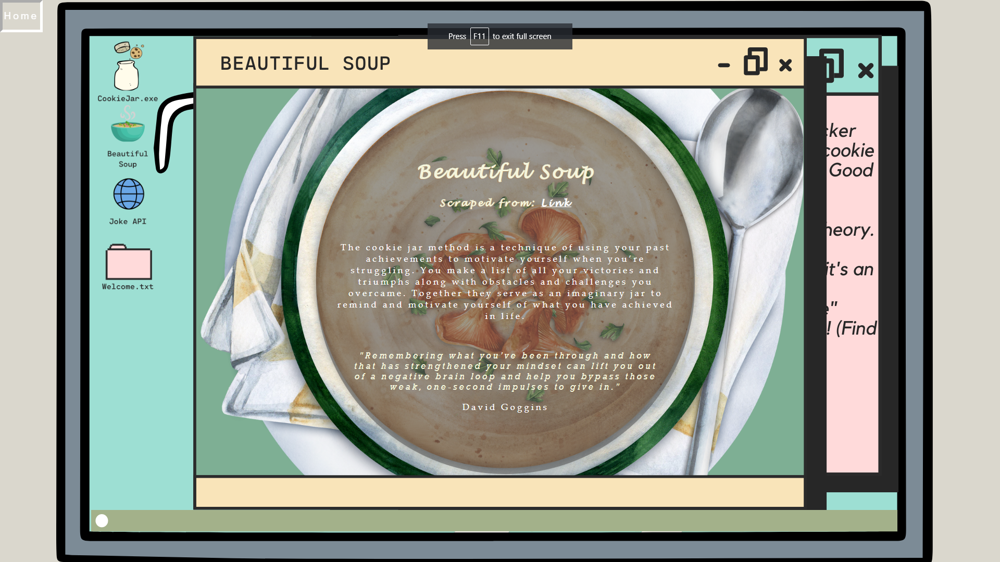

 

  

<h3 align="center">Accomplishment Cookie Jar</h3>

 

<!-- TABLE OF CONTENTS -->

  
Table of Contents

  <ol>
    <li>
      <a href="#about-the-project">About The Project:</a>
      <ul>
        <li><a href="#built-with">Built With</a></li>
      </ul>
    </li>
    <li><a href="#welcometxt">Welcome.txt:</a></li>
    <li>
      <a href="#cookiejarexecrud">CookieJar.exe(CRUD):</a>
      <ul>
        <li><a href="#create">Create</a></li>
        <li><a href="#read">Read</a></li>
        <li><a href="#update-and-delete">Update and Delete</a></li>
      </ul>
    </li>
    <li><a href="#beautiful-soup">Beautiful Soup:</a></li>
    <li><a href="#joke-api">Joke API:</a></li>
    <li><a href="#front-end-development">Front-End Development:</a></li>
    <li><a href="#skills-aquired">Skills Aquired:</a></li>
    <li><a href="#contact">Contact:</a></li>
  </ol>

 

# About The Project:
During a two week sprint at [The Tech Academy](https://www.learncodinganywhere.com/) I had the opportunity to work with a team of very talented Software Engineers on a web Application called the App Builder 9000! The App Builder 9000 is an interactive website for managing one's collections of things related to various hobbies, as well as API and Data Scraped content for those hobbies.

The goal of the project was to create an app within The App Builder 9000 with a topic of our own choice working with Python and Django utilizing their various features such as the Model, View, Template [(MVT)](https://www.geeksforgeeks.org/django-project-mvt-structure/). When building the app we needed to create databases to keep track of data, build a Create, Read, Update, Delete [(CRUD)](https://www.geeksforgeeks.org/django-crud-create-retrieve-update-delete-function-based-views/) functionality, have the app interact with APIs to retrieve data, use data scraping to collect and aggrigate data, and more! For the duration of the sprint we worked under the [Azure Devops](https://azure.microsoft.com/en-us/products/devops/) environment following the [Agile/Scrum](https://www.visual-paradigm.com/scrum/what-is-agile-and-scrum/) methodogies and being assigned to finish a total of 10 stories (2-9 being the main focus) before the end of the two week sprint.

| NOTE: This repository does NOT contain the "Appbuilder9000" as I do not have permission to share my peers projects but, you do have access to the code for my individual application [here](https://github.com/CodeHappy01/Live-Projects-for-The-Tech-Academy/tree/main/Accomplishment-CookieJar/AccomplishmentTracker) |

With the ability to pick our own topic and work on our own seperate applications for the main site, this gave my team and I a chance to really showcase are skills from both the back-end to the front-end. 

The Application that I decided to create was [The Accomplishment Cookie Jar](https://github.com/CodeHappy01/Live-Projects-for-The-Tech-Academy/tree/main/Accomplishment-CookieJar/AccomplishmentTracker). The main pupose of my application is to allow people to keep track of their accomplishments to give them a way to boost there confidence in the future, whenever in need. The idea of tracking accomplishments was inspired by David Goggins [Cookie Jar theory.](https://productiveclub.com/cookie-jar-method/#:~:text=The%20cookie%20jar%20method%20is%20a%20technique%20of,yourself%20of%20what%20you%20have%20achieved%20in%20life.)

Although, from the very start, my site revolved around the Cookie Jar idea, it sorta just slowly evolved into something much more. From a simple idea of having just a Cookie Jar that maybe let you drop an "accomplishment cookie" in it by a simple button click...

(Drawing I made during brainstorming phase for my application topic)

I was able to create a web application that puts you in a cozy room that allows you to interact with a computer screen within your computer screen! By clicking the "Full Screen" button from the main page it lets you use the four provided apps on the desktop screen. The [CookieJar.exe](#cookiejarexecrud) (CRUD), [The Beautiful Soup](#beautiful-soup) (data scraped webpage), [Joke API](#joke-api) (API), and the [Welcome.txt](#welcometxt) (briefly explains what each app does). From the main screen I even decided to add a [Christmas](#christmas) button that navigates you to an parallel dimension of sorts, where you work in an office building preparing for Christmas time!

How I made my background, icons and most of my styling really come to life was by utilizing the site [Canva](https://www.canva.com/), a graphic design platform that is used to create visual content for social media, presentations, websites and more! The site gives you access to many copyright free assets of images both free or paid. I highly recommend it to anyone!

 

## Built With

HTML | CSS | SQLITE | JS | PYTHON | DJANGO | PYCHARM | CANVA

 

# Welcome.txt

 

 
(<a href="#readme-top">back to top</a>)

 

# CookieJar.exe(CRUD):

 
 
  

## Create 

  
Story 2: Create your model <a href="https://github.com/CodeHappy01/Live-Projects-for-The-Tech-Academy/blob/main/Accomplishment-CookieJar/AccomplishmentTracker/templates/AccomplishmentTracker/AccomplishmentTracker_create.html">[TPL]</a>

  <ol>
    <ul>
      
 
  I create a model for tracking Accomplishments with an objects manager for accessing the database, Create a model form that will include any inputs the user needs to make, add a views function that renders the an html create page and utilizes the model form to save the collection item to the database.
      

      <li> Model-    
https://github.com/CodeHappy01/Live-Projects-for-The-Tech-Academy/blob/6a11c4e71f0661360b7deb38fe4b2f0ff7d3c127/Accomplishment-CookieJar/AccomplishmentTracker/models.py#L4-L17
      </li>
      <li> Model Form-
        https://github.com/CodeHappy01/Live-Projects-for-The-Tech-Academy/blob/7eacd8a182faff64c9c6a9f5e7e3dbd99cfa8349/Accomplishment-CookieJar/AccomplishmentTracker/forms.py#L6-L9
      </li>
      <li> View-
        https://github.com/CodeHappy01/Live-Projects-for-The-Tech-Academy/blob/6a11c4e71f0661360b7deb38fe4b2f0ff7d3c127/Accomplishment-CookieJar/AccomplishmentTracker/views.py#L33-L42
      </li>
    </ul>
  </ol>

(<a href="#readme-top">back to top</a>)

 

## Read 

  
Story 3: Display all items from database <a href="Accomplishment-CookieJar/AccomplishmentTracker/templates/AccomplishmentTracker/AccomplishmentTracker_read.html">[TPL]</a>

  <ol>
    <ul>
      
 
  Display information from the database in a page. Create a new HTML page, link it from your home page. Add in a function that gets all the items from the database and sends them to the template. Display a list of items from the database, with some of the fields for that item displayed with labels/headers. Add whatever styling is appropriate to your templates. 
      

      <li> Model-    

      </li>
      <li> Model Form-

      </li>
      <li> View-
        https://github.com/CodeHappy01/Live-Projects-for-The-Tech-Academy/blob/6a11c4e71f0661360b7deb38fe4b2f0ff7d3c127/Accomplishment-CookieJar/AccomplishmentTracker/views.py#L45-L50
      </li>
    </ul>
  </ol>

  
Story 4: Details page <a href="Accomplishment-CookieJar/AccomplishmentTracker/templates/AccomplishmentTracker/AccomplishmentTracker_details.html">[TPL]</a>

  <ol>
    <ul> 
      

  Created a details page that will show the details of any single item from within the database, as selected by the user, link this to the base page for each item. Add a details template to the template folder, register the url pattern. Create a views function that will find a single item from the database and send it to the template. Add in a link for each item on the display all items page that will direct to the details page for that item. Display all the details of the item on the details page. 
      

      <li> Model-    
        
      </li>
      <li> View-

      </li>
    </ul>
  </ol>

 
(<a href="#readme-top">back to top</a>)

  

## Update and Delete 

  
Story 5: Edit and Delete Functions<a href="Accomplishment-CookieJar/AccomplishmentTracker/templates/AccomplishmentTracker/AccomplishmentTracker_update.html">[Edit TPL]</a><a href="Accomplishment-CookieJar/AccomplishmentTracker/templates/AccomplishmentTracker/AccomplishmentTracker_delete.html">[Delete TPL]</a>

  <ol>
    <ul> 
      

  Allow for edits and delete functions to be done from the details page or from separate pages. Have confirmation before deleting. 

Add an edit page to the templates (another pattern url) 

Use model forms and instances to display the content of a single item from the database 

Have the views function send the information for the single item and save any changes. 

Include the option to delete an item with a confirmation that the user wants to delete. 

Add whatever styling is appropriate to your templates. 

You are finished with the story when you have a functioning edit page for any item in the database, and the ability to delete that item. Make sure to test and debug before submitting. 

Optional Add-On: 
-Use a modal and javascript for the delete confirmation message 
      

      <li> Model-    

      </li>
      <li> Model Form-

      </li>
      <li> View-

      </li>
    </ul>
  </ol>

 
(<a href="#readme-top">back to top</a>)

 

# Beautiful Soup: 

  
Story 6: Setup Beautiful Soup<a href="Accomplishment-CookieJar/AccomplishmentTracker/templates/AccomplishmentTracker/AccomplishmentTracker_BS.html">[TPL]</a>

  <ol>
    <ul> 
      

  Create a new template for displaying information sourced from another website. Use Beautiful Soup to data scrape the site and find the relevant information. 

Create a new template for displaying the content 

Use Beautiful Soup to get the html data from your selected site as a navigable object 

Utilizing whatever options necessary, get the section of data you want to scrape 

Add comments to note which portions of the data you're trying to extract 

Link the data scraping page to the app's home page 
      

      <li> Model-    

      </li>
      <li> Model Form-

      </li>
      <li> View-

      </li>
    </ul>
  </ol>

  
Story 7: Parse through HTML<a href="Accomplishment-CookieJar/AccomplishmentTracker/templates/AccomplishmentTracker/AccomplishmentTracker_BS.html">[TPL]</a>

  <ol>
    <ul> 
      

  Parse through the html returned and display the information you want to display. Make sure you are getting into the individual elements and stripping away any formatting you don't want. Add a link from your app's home page. 

Get elements out of your Beautiful Soup object, send just the values you want as relevant dictionary objects to the template (nested dictionaries are fine) 

Display all objects within the data scrape template 

Test to make sure everything works as expected, do error handling where necessary 

Add whatever styling is appropriate to your templates. 

This is the last Beautiful Soup story. Make sure it has all the functionality that you want. 
      

      <li> Model-    

      </li>
      <li> Model Form-

      </li>
      <li> View-

      </li>
    </ul>
  </ol>

 
(<a href="#readme-top">back to top</a>)

  

# Joke API: 

  
Story 6: Connect to API<a href="">[TPL]</a>

  <ol>
    <ul> 
      

  Connect to your chosen API and get the JSON response, add in a template for displaying the information. 

Create a new API template and render with a function 

Go through the API documentation 

Connect to the API and write a basic JSON response (either to a txt file or the terminal) 

Add comments of which elements from the JSON response you're looking to get the value for 

Link the API request page to the app's home page. 

      

      <li> Model-    

      </li>
      <li> Model Form-

      </li>
      <li> View-

      </li>
    </ul>
  </ol>

  
Story 7: Parse through JSON<a href="">[TPL]</a>

  <ol>
    <ul> 
      

  Parse through the JSON file returned and display the information you want to display. Make additional queries to the API as necessary. Add a link from your app's home page. 

Get elements out of your API JSON response, send just the values you want as relevant dictionary objects to the template (nested dictionaries are fine) 

Display all objects either in the original API service page or in a new results page. 

Test to make sure all the options work as expected, do error handling where necessary 

Add whatever styling is appropriate to your templates. 

This is the last API story. Make sure it has all the functionality that you want. 

You are finished with the story when you have information displaying from the API on your API page, and you've added all functionality you want to interact with the API. Make sure to test and debug before submitting. 
      

      <li> Model-    

      </li>
      <li> Model Form-

      </li>
      <li> View-

      </li>
    </ul>
  </ol>

 

  
Story 9: Save API or scraped results<a href="">[TPL]</a>

  <ol>
    <ul> 
      

  Allow the user to save "favorites" of an item either from the information detailed from the API or from Beautiful Soup. This could mean working with the existing model or creating a new one to pull the information from the response, create the appropriate object, and add it to the database. 

You are finished with the story when you have the ability to save an item to the database with a few clicks from either your API page or your Data Scraping page. It is fine to have additional pages for the confirmation and display process. 

      

      <li> Model-    

      </li>
      <li> Model Form-

      </li>
      <li> View-

      </li>
    </ul>
  </ol>

 
(<a href="#readme-top">back to top</a>)

 

# Front End Development:

  
Story 8: Front End Improvements<a href="">[CSS]</a>

  <ol>
    <ul> 
      

  I went back to my templates/CSS/JS and add improvements to the UI/UX.
      

    </ul>
  </ol>

 

## Christmas

At the end of my stories I decided to have a bit of fun with the time I had left and made a Christmas template through Canva and back in Pycharm I decided to add a Christams video along with a count down till Christmas counter using Javascript: 

 

  
Counter

  
  <ol>
    <ul>
      <li> JS-
https://github.com/CodeHappy01/Live-Projects-for-The-Tech-Academy/blob/bccf8525bc902442ce7024f828d99df38b968608/Accomplishment-CookieJar/AccomplishmentTracker/static/js/AccomplishmentTracker.js#L13-L66
      </li>
    </ul>
  </ol>

 
(<a href="#readme-top">back to top</a>)

 
 
<!--
## Window Browswer Scaling - 

So media queries was defintely something that I had trouble working with. The big problem I ran into that I temporaly fixed was having my icons on the full screen overlap out of the background image whenever I scaled my browser window to be smaller. This was a problem because of how I setup my background for each template and icons where they are not able to stick to each other. One solution would to have put both the background image and icons into a div for each template it would have taken quite a bit of tweaking my code and my time was limited so I couldnt do that. So, what I ended up doing was making my media queries for the site make my icons along with other parts of the site center into the middle of the screen at a certain width and height.

 
(<a href="#readme-top">back to top</a>)

  
-->

# Skills Acquired: 

 

- A skill that I found to be pretty good at is utilizing Canva’s to build my backgrounds and icons for my web application. Being able to express my creativity without spending too much time with my own drawings   definitely something that I will take with me and  

 

- Another is being able to work with a team of others and communicating how my application works, and even helping others.  

 

- Obvious skills that I note from the project was working with the model, view, templates layout of django,.  

 
(<a href="#readme-top">back to top</a>)

 

# Contact:

- I had an amazing experience with this project and The Tech Academy and happy with what I was able to accomplish within the 2 week time frame. Although there is alot of things I could have done better I learned alot and will be sure to take these lessons into my future projects.
- 
-   I actually do plan on going back and using this as a framework for a bigger personal project that I wish to work on. If you would like details or are interested in possible collaberating on this project or even if you just want to get in contact to ask me questions, reach out to me at my email or LinkedIn.

- Email: bradleyrobles88@gmail.com
- [LinkedIn](https://www.linkedin.com/in/bradley-robles/)

 
(<a href="#readme-top">back to top</a>)

 

 
